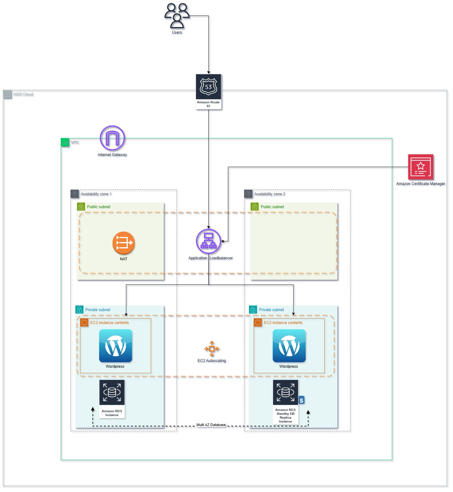

# Deploying a Highly Available & Scalable Wordpress Server on AWS

<!-- Xgrid Learning and Development Program -->

This module focuses on deploying a highly available and scalable Wordpress server using AWS Cloud infrastructure and services. Wordpress server should be autoscaled on the basis of CPU utilization and accessible through an application load balancer redirecting to the Wordpress server's UI present in a public subnet. The database used in this module would be AWS RDS and engine can be of your choice (MYSQL or POSTGRESQL).

## Specialization Module Architecture 

### Tool & Technologies used:

You need to install the following tools:

 - [Terraform](https://www.terraform.io/downloads)
 - [AWS CLI](https://docs.aws.amazon.com/cli/latest/userguide/getting-started-install.html)
 - [Terraform docs](https://terraform-docs.io/user-guide/installation/)
 - [AWS IAM User Account](https://aws.amazon.com/console/)  
 - [Wordpress](https://wordpress.org/download/)

## Estimated Time To Complete:

1 sprint = 1 week

## Infrastructure as Code:

The Application's infrastructure will be provisioned using Terraform.

## Sprint Task Details

### Major Arhitecture Components

This sprint focuses on automating a wordpress based application on AWS using set of practices to achieve fault tolerance and high availability. Although there are several micro level components that will be a part of the provisioned architecture, but the major ones to be mentioned are as follows:
- VPC
  - Public Subnets
  - Private Subnets
  - Route Tables
  - Route Table Associations
  - Security Groups
- Internet Gateway
- NAT Gateway
- RDS (MySQL or PostgresSQL)
- Autoscaling group (For EC2)
  - Launch Configurations
- Application Load Balancer
  - ALB Listner
  - ALB Target Group

### Deployment Instructions
- Please make sure to provision free-tier resources unless required or specified. Information on each service's types is available at the [aws website](https://aws.amazon.com/free/?all-free-tier).

- Make sure to de-provision infra. after you've given a demo or tested it.

### Creating a Virtual Private Cloud  
The instructions for spinning up a fresh Virtual Private Cloud with its sub components using terraform is discuessed in [VPC specialization module using terraform as infrastructure as code on AWS] [Link] ,So you can refer it for a detailed walkthrough and sprint related guidelines of Specialization Module.

### Creating an AWS Relational Database ( Multi-AZ ) 
Now, you need to create an RDS with terraform with engine of your choice ( MySQL OR PostgreSQL ) . Database should be Multi-AZ to withstand fault tolerance and failover. 

### Connecting Wordpress to the RDS 
Wordpress needs to connect with a database to work properly else it throws an error of `Error Establishing Database Connection` and the UI of Wordpress is not accessible. So, we need to figure out a way to connect the provisioned Wordpress EC2 instance on the fly with the Database to run the wordpress server work as desired. 

**HINT** Bash script advance commands can be used to connect and pass the RDS credentials to the wordpress **wp-config.php** file.

### Creating a Launch Configuration and Autoscaling Group ( High Scalability )

#### Creating Launch Configuration 
The next step would be to create a launch configuration for the EC2 Autoscaling Group. Launch Template is a metadata just like an EC2 configuration in Terraform where you specify attributes you want to have in your instance provisioned on AWS. You need to create the launch configuration and attach the launch configuration to the Autoscaling group's resource so that any scaled instances have all the desired attributes ( user-data, ami, instance-size, subnet etc. ) THe user data script created above will be passed to the launch configuration resource in terraform.

#### Autoscaling Group
For now, you can keep your autoscaling group simple and just add required and mandatory attributes that seem needed for the autoscaling group resource. You need to have a minimum, maximum and desired capacity of instances to analyze that the autoscaling group is working fine or not. Autoscaling should cover multiple subnets to demonstrate high scaleability in different availability zones. 

### Creating an Application Load Balancer and Target Group  ( High Availability )
Our next milestone would be to create an application load balancer and a target group. An ALB Target group is required to be created which will be pointing to the Autoscaled Instances as the target. The target group attached to the load balancer will aid in high availability forwarding traffic to the instances. Load balancer should cover multiple subnets so that it becomes highly available and routes traffic to the wordpress instances.

### Integration of AutoScaling Group with Application Load Balancer 
The next important milestone is to connect the autoscaling group with the application load balancer so that the scaled instances are behind a load balancer and a user accesses them using a ALB's DNS. This will divide your traffic and send them on multiple instances simultaneously when autoscaling happens. 

## BONUS / Level Up
As a bonus step and increasing a bit of difficulty level, you can play around the following fun stuff

- Configure Autoscaling Policies for the Autoscaling group and scale up your instances on the basis of CPU and Memory Utilization Metrics. For instances, if Wordpress EC2 instance's CPU usage goes higher than 40% (since this is development sprint) OR Memory Utilization is greater than 60% , a new Wordpres EC2 instace should spin up.

- Similarly, if the CPU and Memory Utilization goes down than the assgined threshold, the EC2 instances should scale down automatically on the basis of scaling policies. 

- Adding to this, you can configure CloudWatch Alarms that should trigger if there is a spike in CPU or Memory Usage and it reaches to 70%. ( To verify your cloudwatch alarm working perfectly , you may lower the threshold of the metrics )

## Deliverables

### Terraform Scripts: 
Acceptance criteria includes terraform scripts with all the modules deploying successfully.

### Results 
You need to attach the expected results of the sprint outcome like screenshot of your live Wordpress EC2 server running successfully.

### Documentation:

Write a markdown README doc defining the architecture of your application and commit it to a GitHub repo.
